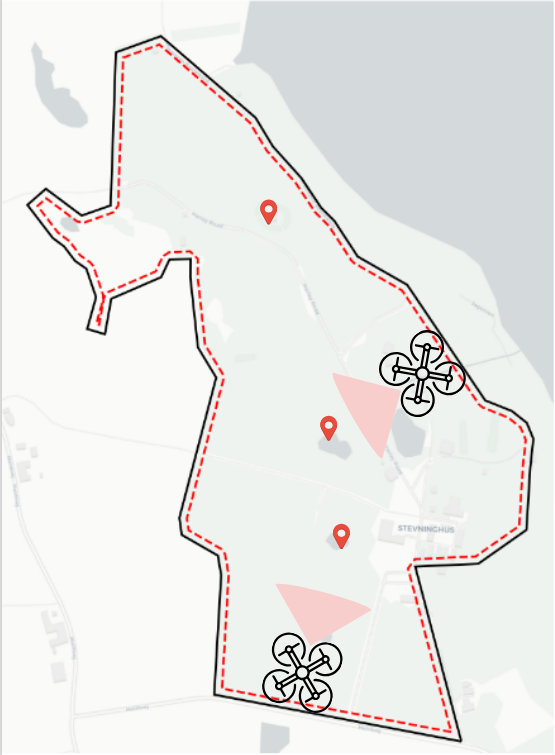
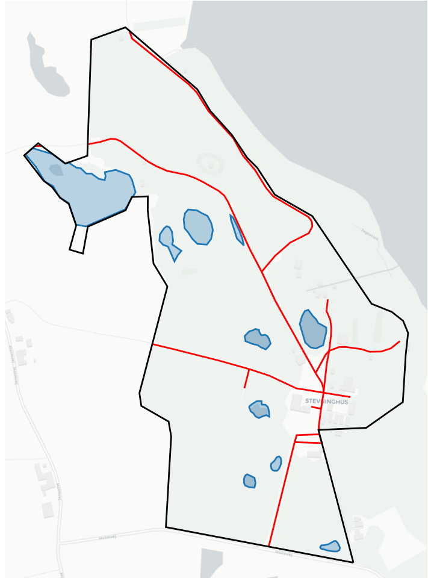
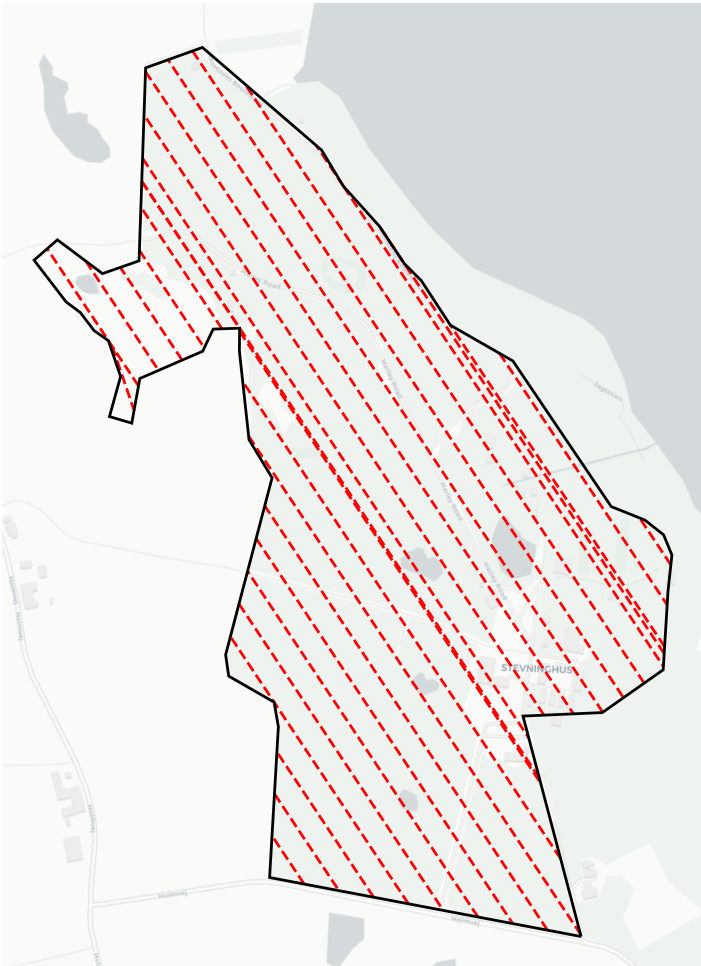

# TrajGenPy


[](https://github.com/kasperg3/trajgenpy/actions/workflows/test.yml)
[](https://www.python.org/downloads/)

**TrajGenPy** is a powerful Python library designed for generating coverage trajectories using the Boustrophedon Cell Decomposition algorithm. This library facilitates the extraction of environmental features from OpenStreetMap (OSM) and converts them into geodetic coordinates, enabling efficient and effective coverage path planning. By leveraging the capabilities of TrajGenPy, users can easily generate coverage paths for various applications such as agricultural field coverage, robotic vacuum cleaning, and environmental monitoring.

<div style="display: flex; justify-content: space-between;">
  
  
  
</div>

## Features

- **Coverage Path Generation**: Boustrophedon Cell Decomposition algorithm for efficient coverage patterns
- **OSM Integration**: Extract and convert environmental features from OpenStreetMap to geodetic coordinates
- **Polygon Operations**: Decomposition, sweep pattern generation, and obstacle handling
- **Visualization**: Easy plotting and export to GeoJSON format
- **High Performance**: Python bindings for optimized C++ algorithms

## Installation

The package is regularly updated and new releases are created when significant changes to the main branch has happened.

Requirements:
```bash
sudo apt-get update && apt-get -y install libcgal-dev pybind11-dev
```

Install using pip:
```bash
pip install trajgenpy
```

## Build from source

Before building TrajGenPy, ensure you have the following requirements installed:

- [libcgal-dev](https://www.cgal.org/) - The Computational Geometry Algorithms Library
- [pybind11-dev](https://pybind11.readthedocs.io/en/stable/) - A lightweight header-only library for creating Python bindings

You can install these dependencies on Ubuntu using the following commands:

```bash
sudo apt-get update && apt-get -y install libcgal-dev pybind11-dev
```

Once you have the dependencies installed, you can install TrajGenPy using `pip`. Simply navigate to your project directory and run:

```bash
pip install -r requirements.txt
pip install -e .
```

The "-e" argument for pip is to enable the developer to edit the python source code and perform tests without having to rebuild everything.

## Quick Start

```python
import trajgenpy

# Basic usage - see detailed example below
```

## Example: Coverage Path Generation with Obstacles

Here's a complete example demonstrating how to generate coverage paths for a polygon with obstacles:

```python
import shapely
from matplotlib import pyplot as plt
from trajgenpy import Geometries

# Define the outer polygon (area to cover)
poly = shapely.Polygon([
    [10.470650724002098, 55.38520996875883],
    [10.469291130631092, 55.38477524425895],
    [10.468346742421403, 55.3855938172706],
    [10.466164880005067, 55.384530131529345],
    [10.46587993528641, 55.38429426690277],
    [10.46378762692467, 55.381052141937516],
    [10.46446335297145, 55.38091801121436],
    [10.465041383686241, 55.380941137233464],
    [10.465733392288826, 55.3808902599732],
    [10.466262575337083, 55.3807653791485],
    [10.467736146595996, 55.38083475743292],
    [10.469681911959213, 55.38064974840299],
    [10.470015704344348, 55.381177021857354],
    [10.4717823615984, 55.38068212504581],
    [10.472189425482355, 55.380964263239036],
    [10.473744409517451, 55.38081625656886],
    [10.470553028670054, 55.381861541821166],
    [10.469535368961601, 55.38115852115337],
    [10.467695440207848, 55.381491532500746],
    [10.469193435299047, 55.38253217489091],
    [10.467003431605235, 55.3834109182535],
    [10.468371166253775, 55.384391387802054],
    [10.47115548321807, 55.38393815489968],
    [10.471619536045012, 55.384285017281144],
    [10.470650724002098, 55.38520996875883],
])

# Create GeoPolygon and set coordinate reference system
geo_poly = Geometries.GeoPolygon(poly)
geo_poly.set_crs("EPSG:3857")

# Define an obstacle (hole in the coverage area)
hole = shapely.Polygon([
    [10.465643258937206, 55.38227460993366],
    [10.464960949768766, 55.38131078946813],
    [10.466980216090207, 55.380975542061805],
    [10.46771784762305, 55.38200746639646],
    [10.465643258937206, 55.38227460993366],
])

hole = Geometries.GeoPolygon(hole)
hole.set_crs("EPSG:3857")

# Decompose polygon considering obstacles
polygon_list = Geometries.decompose_polygon(
    geo_poly.get_geometry(), obstacles=hole.get_geometry()
)

# Generate sweep pattern
offset = Geometries.get_sweep_offset(0.1, 30, 100)
result = []
for decomposed_poly in polygon_list:
    sweeps = Geometries.generate_sweep_pattern(
        decomposed_poly, offset, clockwise=True, connect_sweeps=True
    )
    result.extend(sweeps)

# Create trajectory collection
multi_traj = Geometries.GeoMultiTrajectory(result, "EPSG:3857")

# Plot the results
geo_poly.plot(facecolor="grey", edgecolor="black", linewidth=2, alpha=0.4)
hole.plot(facecolor="red", edgecolor="red", linewidth=2, alpha=0.2)
multi_traj.plot(color="black", linewidth=1)
plt.axis("equal")
plt.axis("off")
plt.show()
```

This example demonstrates:

- Creating polygons with obstacles
- Coordinate reference system handling
- Polygon decomposition for coverage planning
- Sweep pattern generation
- Visualization of results

## Contributing & Development

Install the bindings in dev mode. The bindings have to be reinstalled if any of the trajgenpy_bindings package is changed.

```bash
pip install -e .
```

To contribute to trajgenpy, start by forking the repository on GitHub. Create a new branch for your changes, make the necessary code edits, commit your changes with clear messages, and push them to your fork. Create a pull request from your branch to the original repository, describing your changes and addressing any related issues. Once your pull request is approved, a project maintainer will merge it into the main branch.

## OSM Feature Extraction

Using this library it becomes very easy to extract features from OpenStreetMap and convert the different geometries to and from geodetic coordinates.


Both of the examples shown above have been generated using less than 20 lines of code. More examples and extensions to the library are in development. The specific tags of the features which can be queried can be found in the [OpenStreetMap Map Features documentation](https://wiki.openstreetmap.org/wiki/Map_features).

### Coverage Path Generation

TrajGenPy provides functionality for trajectory task generation using the Boustrophedon Cell Decomposition algorithm for coverage generation. It is an extension of the C++ implementation found in the [ethz-asl/polygon_coverage_planning](https://github.com/ethz-asl/polygon_coverage_planning) repository, with additional features and Python bindings.

Many coverage problems use the boustrophedon (way of the ox) coverage pattern and has been implemented in Python using [ethz-asl/polygon_coverage_planning](https://github.com/ethz-asl/polygon_coverage_planning) through C++ bindings. The coverage patterns can be applied to all types of polygons.

## Citation

If you use TrajGenPy in your work, please cite the following paper:

```bibtex
@inproceedings{grontved2022icar,
  title={Decentralized Multi-UAV Trajectory Task Allocation in Search and Rescue Applications},
  author={Gr{\o}ntved, Kasper Andreas R{\o}mer and Schultz, Ulrik Pagh and Christensen, Anders Lyhne},
  booktitle={21st International Conference on Advanced Robotics},
  year={2023},
  organization={IEEE}
}
```

## License

This library is released under the [MIT License](LICENSE). Feel free to use, modify, and distribute it in your projects.

## Issues and Contributions

If you encounter any issues or have ideas for improvements, please open an issue on the [GitHub repository](https://github.com/kasperg3/trajgenpy). Contributions in the form of pull requests are also welcome.

## Support

For support and inquiries, you can contact the maintainers of this library at [kaspergrontved@gmail.com](mailto:kaspergrontved@gmail.com).

Thank you for using TrajGenPy! We hope it proves to be a valuable tool for your trajectory generation and task planning needs.
