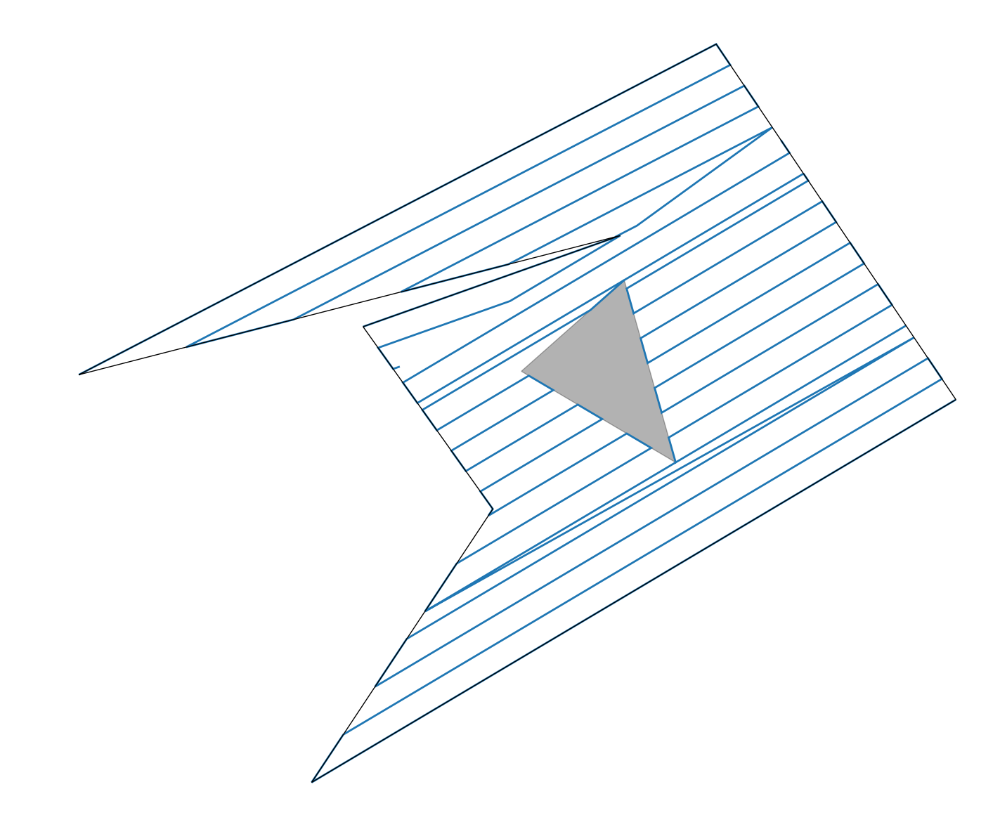
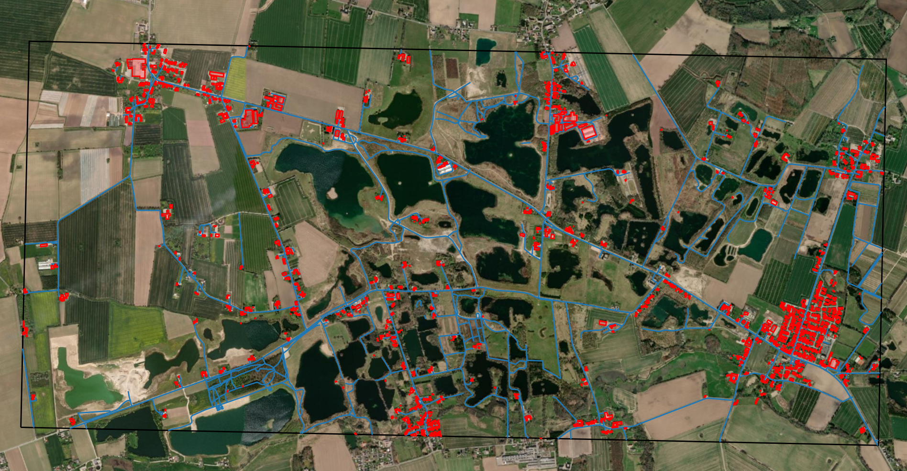

# TrajGenPy


[](https://github.com/kasperg3/trajgenpy/actions/workflows/test.yml)
[](https://www.python.org/downloads/)

**TrajGenPy** is a Python library that provides functionality for trajectory task generation using the Boustrophedon Cell Decomposition algorithm for coverage generation. It is an extension of the C++ implementation found in the [ethz-asl/polygon_coverage_planning](https://github.com/ethz-asl/polygon_coverage_planning) repository, with additional features and Python bindings.

## Features

### Covereage path generation

Many coverage problems use the boustrophedon (way of the ox) coverage patter and has been implemented in python using [ethz-asl/polygon_coverage_planning](https://github.com/ethz-asl/polygon_coverage_planning) through c++ bindings.
The example below has been created using very few lines, and can be applied to all types of polygons.



### [OSM](https://wiki.openstreetmap.org/wiki/Main_Page) Feature extraction

Using this library it becomes very easy to exctract features from Openstreetmap and convert the different geometries to and from geodetic coordinates.


Both of the examples showed above has been generated using less than 20 lines of code. More examples and extensions to the library is in the works. The specific tags of the features which can be queried can be found [here](https://wiki.openstreetmap.org/wiki/Map_features).

## Installation

The package is regularly updated and new releases are created when significant changes to the main branch has happened.

```bash
pip install trajgenpy
```

## Build from source

Before building TrajGenPy, ensure you have the following requirements installed:

- [libcgal-dev](https://www.cgal.org/) - The Computational Geometry Algorithms Library
- [pybind11-dev](https://pybind11.readthedocs.io/en/stable/) - A lightweight header-only library for creating Python bindings

You can install these dependencies on Ubuntu using the following commands:

```bash
sudo apt-get update && apt-get -y install libcgal-dev pybind11-dev
```

Once you have the dependencies installed, you can install TrajGenPy using `pip`. Simply navigate to your project directory and run:

```bash
pip install -r requirements.txt
pip install -e .
```

The "-e" argument for pip is to enable the developer to edit the python source code and perform tests without having to rebuild everything.

## Usage

To use TrajGenPy in your Python project, you can import it as follows:

```python
import trajgenpy
```

You can then use the provided functions and classes to perform trajectory generation and task planning based on the Boustrophedon Cell Decomposition algorithm.
See the examples in [a relative link](other_file.md)

# Contributing & Development

Install the bindings in dev mode. The bindings have to be reinstalled if any of the trajgenpy_bindings package is changed.

```bash
pip install -e .
```

To contribute to trajgenpy, start by forking the repository on GitHub. Create a new branch for your changes, make the necessary code edits, commit your changes with clear messages, and push them to your fork. Create a pull request from your branch to the original repository, describing your changes and addressing any related issues. Once your pull request is approved, a project maintainer will merge it into the main branch.

## Citation

If you use TrajGenPy in your work, please cite the following paper:

```bibtex
@inproceedings{grontved2022icar,
  title={Decentralized Multi-UAV Trajectory Task Allocation in Search and Rescue Applications},
  author={Gr{\o}ntved, Kasper Andreas R{\o}mer and Schultz, Ulrik Pagh and Christensen, Anders Lyhne},
  booktitle={21st International Conference on Advanced Robotics},
  year={2023},
  organization={IEEE}
}
```

## License

This library is released under the [MIT License](LICENSE). Feel free to use, modify, and distribute it in your projects.

## Issues and Contributions

If you encounter any issues or have ideas for improvements, please open an issue on the [GitHub repository](https://github.com/kasperg3/trajgenpy). Contributions in the form of pull requests are also welcome.

## Support

For support and inquiries, you can contact the maintainers of this library at [kaspergrontved@gmail.com](mailto:kaspergrontved@gmail.com).

Thank you for using TrajGenPy! We hope it proves to be a valuable tool for your trajectory generation and task planning needs.
