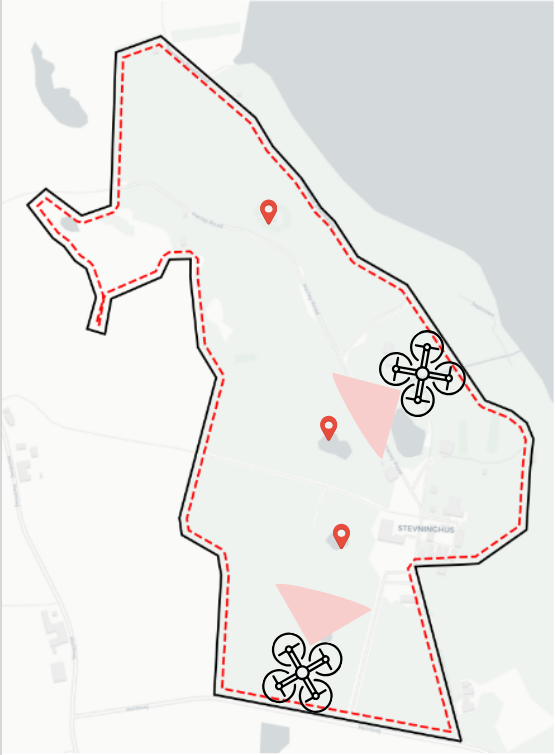
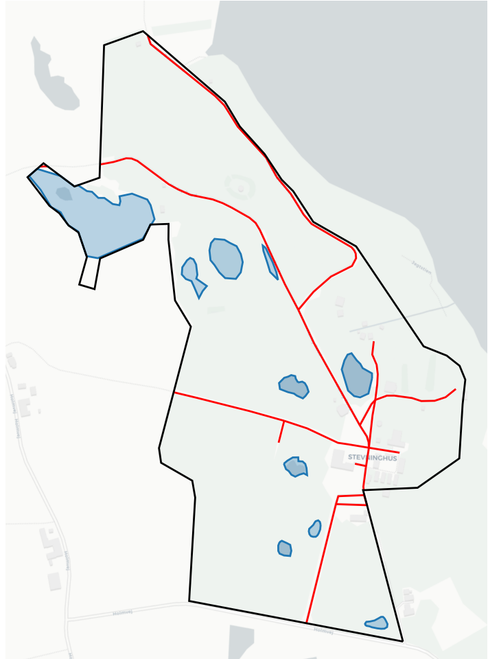
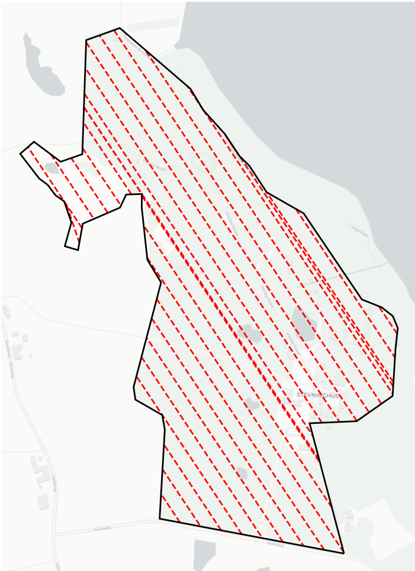
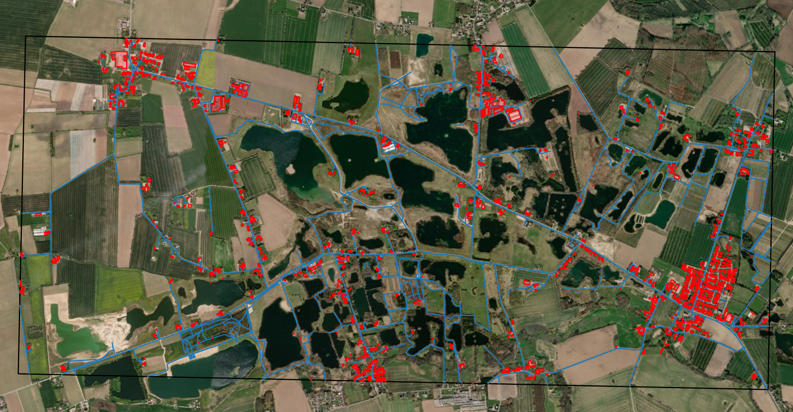

# TrajGenPy


[](https://github.com/kasperg3/trajgenpy/actions/workflows/test.yml)
[](https://www.python.org/downloads/)

**TrajGenPy** is a powerful Python library designed for generating coverage trajectories using the Boustrophedon Cell Decomposition algorithm. This library facilitates the extraction of environmental features from OpenStreetMap (OSM) and converts them into geodetic coordinates, enabling efficient and effective coverage path planning. By leveraging the capabilities of TrajGenPy, users can easily generate coverage paths for various applications such as agricultural field coverage, robotic vacuum cleaning, and environmental monitoring.

<div style="display: flex; justify-content: space-between;">
  
  
  
</div>

## Installation

The package is regularly updated and new releases are created when significant changes to the main branch has happened.

Install using pip:
```bash
pip install trajgenpy
```

## Build from source

TrajGenPy now ships with pure-Python geometry bindings and no longer requires CGAL/pybind11 at build time.
Simply navigate to your project directory and run:

```bash
pip install -r requirements.txt
pip install -e .
```

The "-e" argument for pip is to enable the developer to edit the python source code and perform tests without having to rebuild everything.

## Usage

To use TrajGenPy in your Python project, you can import it as follows:

```python
import trajgenpy
```

You can then use the provided functions and classes to perform trajectory generation and task planning based on the Boustrophedon Cell Decomposition algorithm.
See the examples in [a relative link](other_file.md)

# Contributing & Development

Install in dev mode:

```bash
pip install -e .
```

## Pure-Python bindings rewrite: framework analysis

The previous implementation depended on CGAL + pybind11. For portability and easier installation, the bindings layer was rewritten in pure Python while preserving the existing public API (`Point_2`, `Polygon_2`, `Polygon_with_holes_2`, `Segment_2`, `decompose`, `generate_sweeps`).

Evaluated framework options:

- **Shapely (selected)**  
  Provides robust geometric predicates/operations backed by GEOS, including constrained triangulation and stable polygon clipping. It is already a core dependency and offers good numerical robustness with compiled kernels under the hood.
- **SciPy / Qhull triangulation**  
  Useful for unconstrained triangulation but weaker fit for polygon-with-holes constraints and would require extra stitching logic.
- **Custom pure-Python computational geometry**  
  Highest maintenance and significantly worse numerical stability/performance for this use case.

Chosen approach:

- Use **Shapely constrained triangulation** + convex merge to produce convex decomposition cells.
- Use deterministic sweep-line intersections over rotated polygons for sweep generation.
- Keep data-model compatibility with the original bindings API to minimize downstream changes.

To contribute to trajgenpy, start by forking the repository on GitHub. Create a new branch for your changes, make the necessary code edits, commit your changes with clear messages, and push them to your fork. Create a pull request from your branch to the original repository, describing your changes and addressing any related issues. Once your pull request is approved, a project maintainer will merge it into the main branch.

## [OSM](https://wiki.openstreetmap.org/wiki/Main_Page) Feature extraction

Using this library it becomes very easy to exctract features from Openstreetmap and convert the different geometries to and from geodetic coordinates.


Both of the examples showed above has been generated using less than 20 lines of code. More examples and extensions to the library is in the works. The specific tags of the features which can be queried can be found [here](https://wiki.openstreetmap.org/wiki/Map_features).


### Covereage path generation
is a Python library that provides functionality for trajectory task generation using the Boustrophedon Cell Decomposition algorithm for coverage generation. It is an extension of the C++ implementation found in the [ethz-asl/polygon_coverage_planning](https://github.com/ethz-asl/polygon_coverage_planning) repository, with additional features and Python bindings.

Many coverage problems use the boustrophedon (way of the ox) coverage patter and has been implemented in python using [ethz-asl/polygon_coverage_planning](https://github.com/ethz-asl/polygon_coverage_planning) through c++ bindings.
The example below has been created using very few lines, and can be applied to all types of polygons.

## Citation

If you use TrajGenPy in your work, please cite the following paper:

```bibtex
@inproceedings{grontved2022icar,
  title={Decentralized Multi-UAV Trajectory Task Allocation in Search and Rescue Applications},
  author={Gr{\o}ntved, Kasper Andreas R{\o}mer and Schultz, Ulrik Pagh and Christensen, Anders Lyhne},
  booktitle={21st International Conference on Advanced Robotics},
  year={2023},
  organization={IEEE}
}
```

## License

This library is released under the [MIT License](LICENSE). Feel free to use, modify, and distribute it in your projects.

## Issues and Contributions

If you encounter any issues or have ideas for improvements, please open an issue on the [GitHub repository](https://github.com/kasperg3/trajgenpy). Contributions in the form of pull requests are also welcome.

## Support

For support and inquiries, you can contact the maintainers of this library at [kaspergrontved@gmail.com](mailto:kaspergrontved@gmail.com).

Thank you for using TrajGenPy! We hope it proves to be a valuable tool for your trajectory generation and task planning needs.
